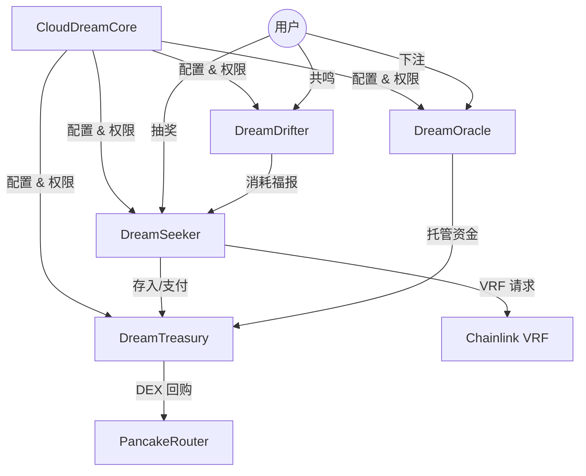

# CloudDream Protocol (云梦协议)

CloudDream 是一个基于区块链的去中心化祈愿与预测市场平台，结合了 NFT、Gacha（抽奖）、SocialFi 和 Prediction Market 机制。

## 📚 目录

- [项目简介](#项目简介)
- [核心架构](#核心架构)
- [合约说明](#合约说明)
- [目录结构](#目录结构)
- [开发与部署](#开发与部署)
- [配置与升级](#配置与升级)
- [权限管理](#权限管理)

---

## 项目简介

**云梦协议** 旨在通过链上随机数 (Chainlink VRF) 和透明的资金流转机制，构建一个公平、有趣的Web3互动平台。

主要功能模块：
1.  **寻真 (Seek Truth)**: 核心抽奖玩法，投入 Token 或 BNB 获取随机结果和奖励。
2.  **听澜 (Drifter)**: 社交裂变系统，通过共鸣 (Resonance) 机制积累福报 (Karma)。
3.  **问天 (Oracle)**: 二元预测市场，用户对未来事件进行下注。
4.  **归墟 (Abyss)**: 终极奖池与分红机制，持有归墟资格者可共享协议收益。

---

## 🏗 核心架构

本项目采用 **Hub-and-Spoke (中心辐射)** 模块化架构，并结合 **UUPS 可升级代理** 模式。

### 架构图示



### 设计原则
1.  **关注点分离**: 
    - **逻辑层**: Seeker (业务), Drifter (社交), Oracle (预测)。
    - **资金层**: Treasury (统一资金托管)。
    - **配置层**: Core (权限、费率、地址索引)。
2.  **可升级性**: 所有逻辑合约均采用 UUPS 标准，支持逻辑迭代而不通过数据迁移。
3.  **安全性**: 统一通过 Core 进行 `AccessControl` 权限校验，资金流出严格受限。

---

## 📜 合约说明

| 合约文件 | 类型 | 描述 |
| :--- | :--- | :--- |
| **CloudDreamCore.sol** | Hub | **核心配置与权限中心**。管理 Admin/Upgrader/Config/Operator 角色，存储全局费率和模块地址。 |
| **DreamSeeker.sol** | Logic | **寻真(业务)合约**。处理抽奖逻辑、VRF 回调、归墟触发、分红计算。包含 `hasPaid` 防刷机制。 |
| **DreamDrifter.sol** | Logic | **听澜(社交)合约**。管理共鸣关系链和福报(Karma)积分。包含推荐人有效性校验。 |
| **DreamTreasury.sol** | Vault | **国库合约**。以资金池形式托管所有 BNB 和 Token。仅允许授权模块(Seeker/Oracle)调用资金。 |
| **DreamOracle.sol** | Logic | **预测市场合约**。管理议题创建、下注、结算。资金实时转入国库托管。 |
| **CloudDreamBatchReader.sol** | View | **批量查询合约**。用于前端一次性获取大量链上状态，减少 RPC 调用次数。 |
| **WishPowerToken.sol** | ERC20 | **平台代币 (WISH)**。用于生态激励和治理。 |

---

## 📂 目录结构

```
ethereal-contracts/
├── contracts/                  # 智能合约源文件
│   ├── CloudDreamCore.sol      # 核心配置
│   ├── DreamSeeker.sol         # 核心业务
│   ├── DreamDrifter.sol        # 社交模块
│   ├── DreamOracle.sol         # 预测市场
│   ├── DreamTreasury.sol       # 资金国库
│   ├── CloudDreamBatchReader.sol # 视图聚合
│   ├── WishPowerToken.sol      # ERC20 代币
│   ├── CloudDreamProtocol.sol  # (旧) 单体合约备份
│   └── interfaces/             # 接口定义 (ICloudDreamCore, etc.)
│
├── deploy/                     # 部署与维护脚本
│   ├── deploy-modular-bsc-testnet.cjs # 【主部署脚本】模块化全量部署
│   ├── upgrade-seeker.cjs      # 单独升级 Seeker
│   ├── upgrade-oracle-reader.cjs # 单独升级 Oracle & Reader
│   ├── check-balance.cjs       # 检查余额与关联
│   ├── upgrade-treasury-seeker.cjs # 升级资金与业务逻辑
│   ├── deploy-modular-bsc-testnet.cjs  # 【主部署脚本】全量部署所有模块
│   ├── upgrade-contract.cjs            # 【通用升级脚本】升级任意 UUPS 合约
│   ├── update-params.cjs               # 【参数配置脚本】批量更新合约参数
│   └── ...
└── hardhat.config.cjs          # Hardhat 配置 (网络、编译器、Verify)
```

---

## 🚀 开发与部署

### 1. 环境准备
```bash
npm install
cp .env.example .env
# 编辑 .env文件，配置 DEPLOYER_KEY 和 BSCSCAN_API_KEY
```

### 2. 编译合约
```bash
npx hardhat compile
```

### 3. 全量部署 (BSC Testnet)
使用模块化部署脚本一键部署所有合约，并自动完成初始化、权限配置和参数设定：
```bash
npx hardhat run deploy/deploy-modular-bsc-testnet.cjs --network bscTestnet
```
*部署后生成的地址文件位于 `deploy/deployment-modular.json`*

### 4. 验证合约
```bash
npx hardhat verify --network bscTestnet <CONTRACT_ADDRESS> <CONSTRUCTOR_ARGS>
# 注意：Proxy 合约验证较为特殊，通常由 Hardhat 插件自动处理实现合约的验证。
```

---

## ⚙️ 配置与升级

### 1. 动态调整参数 (Configuration)
无需升级合约，即可调整概率、费用等参数。
1.  修改 `deploy/update-params.cjs` 中的配置变量。
2.  运行脚本：
    ```bash
    npx hardhat run deploy/update-params.cjs --network bscTestnet
    ```

### 2. 升级合约逻辑 (Upgrade)
本项目采用 UUPS 代理模式，升级仅更新逻辑实现，地址和数据保持不变。
以升级 `DreamSeeker` 为例：
1.  修改 `contracts/DreamSeeker.sol` 代码。
2.  运行通用升级脚本（指定目标合约名）：
    ```bash
    export TARGET_CONTRACT=DreamSeeker
    npx hardhat run deploy/upgrade-contract.cjs --network bscTestnet
    ```

---

## 🔐 权限管理

所有权限通过 `CloudDreamCore` 集中管理 `AccessControl`：

*   **DEFAULT_ADMIN_ROLE**: 超级管理员，拥有最高权限（通常设为多签钱包）。
*   **UPGRADER_ROLE**: 升级者，允许执行 UUPS 升级 (authorizesUpgrade)。
*   **CONFIG_ROLE**: 配置员，允许修改费率、参数、VRF 设置。
*   **OPERATOR_ROLE**: 操作员，允许执行日常任务（如 Oracle 结算、创建议题）。

### 常见操作
- **充值 VRF Gas**: 转账 WISH 代币到 `CloudDreamCore` 或 `DreamSeeker` (取决于 Sub 模式)。
- **提取国库资金**: 仅 Admin 可通过 `DreamTreasury` 的紧急函数提取，或通过正常业务逻辑流转。

## 🔗 参考链接
- [BSC Testnet Explorer](https://testnet.bscscan.com/)
- [Chainlink VRF Docs](https://docs.chain.link/vrf)
- [OpenZeppelin Upgrades](https://docs.openzeppelin.com/upgrades-plugins)
